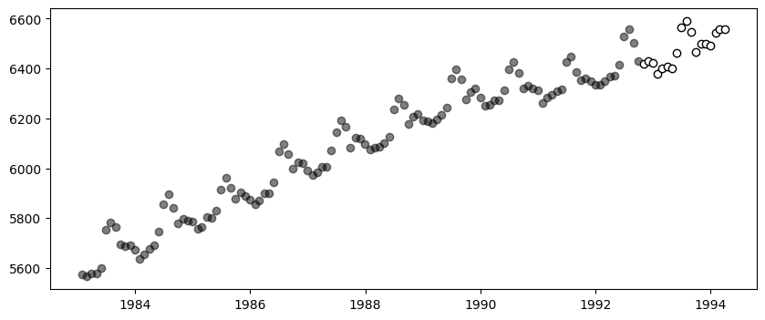
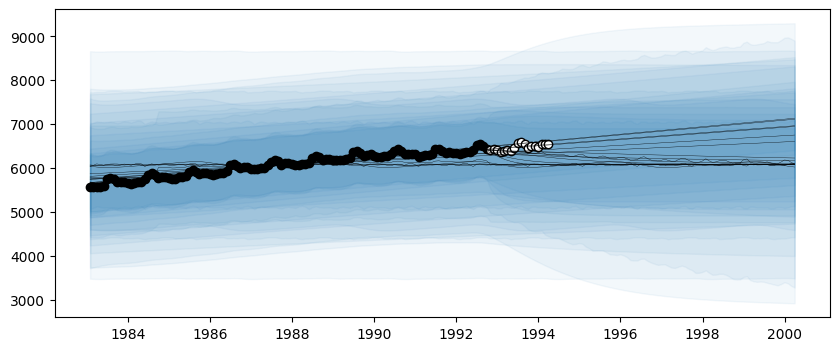
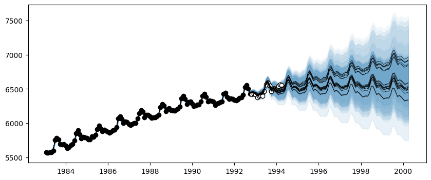
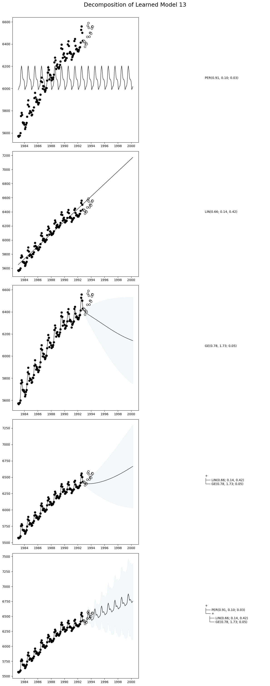
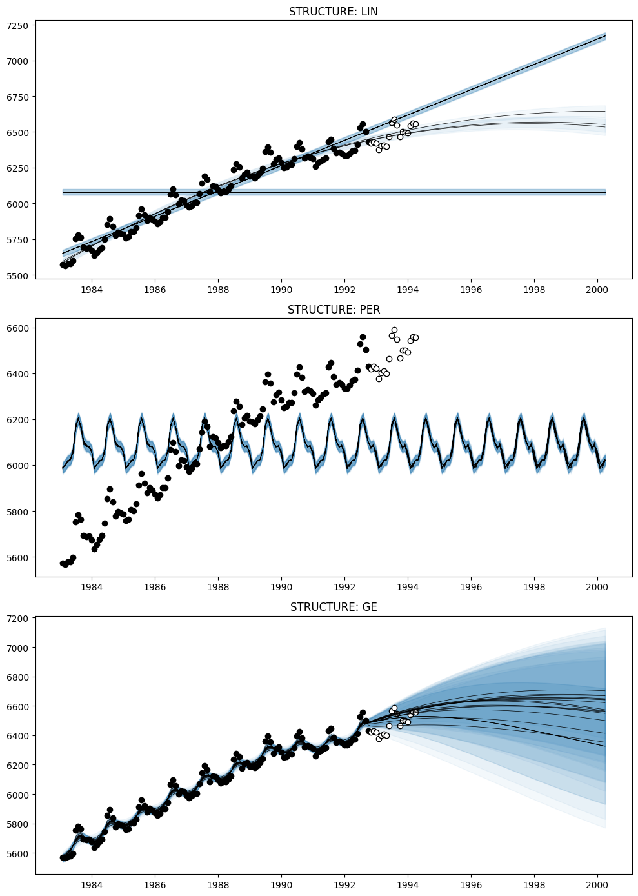

# Time Series Decomposition

This tutorial shows how to decompose AutoGP models into their constituent temporal components, to gain more insight into the learned time series structures.

We will demonstrate two methods.

- [`AutoGP.decompose`](@ref). This function breaks down a composite kernel into its constituent subkernels.
 
- [`AutoGP.extract_kernel`](@ref). This function extracts a specific primitive kernel from a composite kernel, while discarding the others.


```julia
import AutoGP
```


```julia
using CSV
using Dates
using DataFrames
using PythonPlot
```

## Loading Data


```julia
AutoGP.seed!(10)
```


```julia
data = CSV.File("assets/M1266.csv")
M3 = DataFrame(data);
df = M3[:,["ds","y"]];
```

We next split the data into a training set and test set.


```julia
n_test = 18
n_train = DataFrames.nrow(df) - n_test
df_train = df[1:end-n_test, :]
df_test = df[end-n_test+1:end, :]

fig, ax = PythonPlot.subplots(figsize=(10,4))
ax.scatter(df_train.ds, df_train.y, marker="o", color="k", alpha=.5)
ax.scatter(df_test.ds, df_test.y, marker="o", color="w", edgecolor="k", label="Test Data")
```


    

    


    Python: <matplotlib.collections.PathCollection object at 0x71fc21baa480>


## Creating an AutoGP Model


```julia
model = AutoGP.GPModel(df_train.ds, df_train.y; n_particles=18);
```


```julia
ds_future = range(start=df.ds[end]+Dates.Month(1), step=Dates.Month(1), length=4*size(df_test)[1])
ds_query = vcat(df_train.ds, df_test.ds, ds_future)
forecasts = AutoGP.predict(model, ds_query; quantiles=[0.025, 0.975]);
```

Let us visualize the forecasts before model fitting. The model clearly underfits the data.


```julia
fig, ax = PythonPlot.subplots(figsize=(10,4))
for i=1:AutoGP.num_particles(model)
    subdf = forecasts[forecasts.particle.==i,:]
    ax.plot(subdf[!,"ds"], subdf[!,"y_mean"], color="k", linewidth=.25)
    ax.fill_between(subdf.ds, subdf[!,"y_0.025"], subdf[!,"y_0.975"], color="tab:blue", alpha=0.05)
end
ax.scatter(df_train.ds, df_train.y, marker="o", color="k")
ax.scatter(df_test.ds, df_test.y, marker="o", color="w", edgecolor="k", label="Test Data")
```


    

    


    Python: <matplotlib.collections.PathCollection object at 0x71fc1d32ea20>


## Model Fitting via SMC


```julia
AutoGP.fit_smc!(model; schedule=AutoGP.Schedule.linear_schedule(n_train, .025), n_mcmc=50, n_hmc=25, verbose=false);
```


```julia
forecasts = AutoGP.predict(model, ds_query; quantiles=[0.025, 0.975]);
```


```julia
fig, ax = PythonPlot.subplots(figsize=(10,4))
for i=1:AutoGP.num_particles(model)
    subdf = forecasts[forecasts.particle.==i,:]
    ax.plot(subdf[!,"ds"], subdf[!,"y_mean"], color="k", linewidth=.5)
    ax.fill_between(
        subdf.ds, subdf[!,"y_0.025"], subdf[!,"y_0.975"];
        color="tab:blue", alpha=0.05)
end
ax.scatter(df_train.ds, df_train.y, marker="o", color="k", label="Observed Data")
ax.scatter(df_test.ds, df_test.y, marker="o", color="w", edgecolor="k", label="Test Data")
```


    

    


    Python: <matplotlib.collections.PathCollection object at 0x71fc17d37290>


## Hierarchical Decomposition of Kernels

Let us first inspect the learned kernels.


```julia
weights = AutoGP.particle_weights(model)
kernels = AutoGP.covariance_kernels(model)
for (i, (k, w)) in enumerate(zip(kernels, weights))
    println("Model $(i), Weight $(w)")
    display(k)
end
```

    Model 1, Weight 0.09658896969666558


    +
    ├── PER(0.77, 0.10; 0.03)
    └── GE(1.79, 1.74; 0.20)


    Model 2, Weight 0.039614762558316634


    +
    ├── ×
    │   ├── PER(0.74, 0.10; 0.03)
    │   └── LIN(0.09; 0.46, 0.02)
    └── GE(1.41, 1.73; 0.16)


    Model 3, Weight 0.06625733864702288


    +
    ├── PER(0.89, 0.10; 0.03)
    └── GE(1.64, 1.73; 0.12)


    Model 4, Weight 0.010545550106178718


    +
    ├── ×
    │   ├── +
    │   │   ├── PER(0.73, 0.10; 0.04)
    │   │   └── LIN(0.12; 0.48, 0.03)
    │   └── LIN(0.76; 0.05, 0.03)
    └── GE(1.12, 1.82; 0.09)


    Model 5, Weight 0.01043051073070849


    +
    ├── ×
    │   ├── +
    │   │   ├── PER(0.73, 0.10; 0.04)
    │   │   └── LIN(0.25; 0.07, 0.24)
    │   └── LIN(0.76; 0.05, 0.03)
    └── GE(1.12, 1.82; 0.09)


    Model 6, Weight 0.10089196157472988


    +
    ├── PER(0.74, 0.10; 0.03)
    └── +
        ├── LIN(1.36; 0.15, 0.06)
        └── GE(1.41, 1.73; 0.16)


    Model 7, Weight 0.06760101185923048


    +
    ├── PER(0.95, 0.10; 0.03)
    └── GE(1.68, 1.77; 0.21)


    Model 8, Weight 0.036215946339597245


    +
    ├── PER(0.91, 0.10; 0.03)
    └── +
        ├── GE(0.78, 1.73; 0.05)
        └── LIN(0.13; 0.08, 0.07)


    Model 9, Weight 0.05838021457226862


    +
    ├── PER(0.89, 0.10; 0.03)
    └── GE(1.64, 1.73; 0.12)


    Model 10, Weight 0.010614087663444665


    +
    ├── ×
    │   ├── +
    │   │   ├── PER(1.04, 0.10; 0.04)
    │   │   └── LIN(0.37; 0.07, 1.43)
    │   └── LIN(0.13; 0.34, 0.06)
    └── GE(1.62, 1.81; 0.10)


    Model 11, Weight 0.03466466846299965


    +
    ├── PER(0.91, 0.10; 0.03)
    └── +
        ├── LIN(0.66; 0.14, 0.42)
        └── GE(0.78, 1.73; 0.05)


    Model 12, Weight 0.061442233630051295


    +
    ├── LIN(0.40; 0.22, 0.52)
    └── +
        ├── PER(0.89, 0.10; 0.03)
        └── GE(1.64, 1.73; 0.12)


    Model 13, Weight 0.04688201588759647


    +
    ├── PER(0.95, 0.10; 0.03)
    └── +
        ├── LIN(0.49; 0.10, 0.68)
        └── GE(1.53, 1.71; 0.06)


    Model 14, Weight 0.07199528556277592


    +
    ├── PER(0.67, 0.10; 0.03)
    └── GE(1.09, 1.71; 0.16)


    Model 15, Weight 0.039916775290948496


    +
    ├── LIN(0.46; 0.03, 0.56)
    └── +
        ├── PER(0.91, 0.10; 0.03)
        └── GE(0.78, 1.73; 0.05)


    Model 16, Weight 0.06695006913745713


    +
    ├── LIN(0.63; 0.13, 0.31)
    └── +
        ├── PER(0.89, 0.10; 0.03)
        └── GE(1.22, 1.69; 0.09)


    Model 17, Weight 0.09300479594368523


    +
    ├── PER(0.74, 0.10; 0.03)
    └── GE(1.41, 1.73; 0.16)


    Model 18, Weight 0.08800380233632281


    +
    ├── PER(0.67, 0.10; 0.03)
    └── GE(1.09, 1.71; 0.16)


We now use [`AutoGP.decompose`](@ref) to hierarchically break down the composite kernel into all the constituent subkernels.


```julia
decomposed_models = AutoGP.decompose(model);
```


```julia
# Helper function to pretty print covariance.
function show_string(x)
    io = IOBuffer()
    Base.show(io, MIME("text/plain"), x)
    return String(take!(io))
end

# Plot the decomposition of `model` into its constituent parts.
function plot_decomposition(model::AutoGP.GPModel)
    kernels = AutoGP.covariance_kernels(model)
    forecasts = AutoGP.predict(
        model, ds_query;
        quantiles=[0.025, 0.975]);
    fig, axes = PythonPlot.subplots(
        nrows=AutoGP.num_particles(model),
        ncols=2,
        tight_layout=true,
        figsize=(12, 6*AutoGP.num_particles(model)),
        )
    for i=1:AutoGP.num_particles(model)
        subdf = forecasts[forecasts.particle.==i,:]
        # axes[i].set_title(show_string(kernels[i]), ha="left")
        axes[i-1,0].plot(subdf[!,"ds"], subdf[!,"y_mean"], color="k", linewidth=1, label=show_string(kernels[i]))
        axes[i-1,0].fill_between(
            subdf.ds, subdf[!,"y_0.025"], subdf[!,"y_0.975"];
            color="tab:blue", alpha=0.05)
        axes[i-1,0].scatter(df_train.ds, df_train.y, marker="o", color="k", label="Observed Data")
        axes[i-1,0].scatter(df_test.ds, df_test.y, marker="o", color="w", edgecolor="k", label="Test Data")
        axes[i-1,1].text(0.5, 0.5, show_string(kernels[i]), transform=axes[i-1,1].transAxes,  va="center", ha="left")
        axes[i-1,1].set_axis_off()
    end
    return fig, axes
end
```


    plot_decomposition (generic function with 1 method)


Let us plot the decomposition of a given particle in the ensemble.


```julia
idx = 13
fig, ax = plot_decomposition(decomposed_models[11]);
fig.suptitle("Decomposition of Learned Model $(idx)", fontsize=18, va="center", y=1);
```


    

    


## "STL" Style Decomposition

An alternative approach to decomposing kernels is using [`AutoGP.extract_kernel`](@ref), which retains only a specific primitive kernel while discarding the others. In the following example, we will extract the [`AutoGP.GP.Linear`](@ref), [`AutoGP.GP.Periodic`](@ref), and [`AutoGP.GP.GammaExponential`](@ref) kernels from each learned particle to produce an "STL" style decomposition.


```julia
model_per = AutoGP.extract_kernel(model, AutoGP.GP.Periodic);
model_ge = AutoGP.extract_kernel(model, AutoGP.GP.GammaExponential);
model_lin = AutoGP.extract_kernel(model, AutoGP.GP.Linear);
```

Let us study the original and decomposed kernels for a given particle.

Unlike a [traditional time series decomposition](https://en.wikipedia.org/wiki/Decomposition_of_time_series), which typically assumes a fixed additive or multiplicative structure, these decompositions retain the learned structure. For example, the decomposition for `Linear` may have a quadratic term, if the overall kernel has a subexpression of the form `LIN * LIN`.

The kernel structure is retained by using the [`AutoGP.GP.Constant`](@ref) to act as a "noop", as shown below. See also [`AutoGP.extract_kernel`](@ref) for full details.


```julia
idx = 2
println("Model $(idx) - FULL"); display(AutoGP.covariance_kernels(model)[2])
println("Model $(idx) - LIN only"); display(AutoGP.covariance_kernels(model_lin)[2])
println("Model $(idx) - PER only"); display(AutoGP.covariance_kernels(model_per)[2])
println("Model $(idx) - GE only"); display(AutoGP.covariance_kernels(model_ge)[2])
```

    Model 2 - FULL


    +
    ├── ×
    │   ├── PER(0.74, 0.10; 0.03)
    │   └── LIN(0.09; 0.46, 0.02)
    └── GE(1.41, 1.73; 0.16)


    Model 2 - LIN only


    +
    ├── ×
    │   ├── CONST(1.00)
    │   └── LIN(0.09; 0.46, 0.02)
    └── CONST(0.00)


    Model 2 - PER only


    +
    ├── ×
    │   ├── PER(0.74, 0.10; 0.03)
    │   └── CONST(1.00)
    └── CONST(0.00)


    Model 2 - GE only


    +
    ├── ×
    │   ├── CONST(1.00)
    │   └── CONST(1.00)
    └── GE(1.41, 1.73; 0.16)


We can now obtain forecasts corresponding to the Linear, Periodic, and GammaExponential components in each particle.


```julia
forecasts_lin = AutoGP.predict(model_lin, ds_query .+ Day(1); quantiles=[0.025, 0.975]);
forecasts_per = AutoGP.predict(model_per, ds_query .+ Day(1); quantiles=[0.025, 0.975]);
forecasts_ge = AutoGP.predict(model_ge, ds_query .+ Day(1); quantiles=[0.025, 0.975]);
```


```julia
fig, axes = PythonPlot.subplots(figsize=(10,14), nrows=3, tight_layout=true)
for (ax, m, f) in zip(axes, [model_lin, model_per, model_ge], [forecasts_lin, forecasts_per, forecasts_ge])
    for i=1:AutoGP.num_particles(m)
        subdf = f[f.particle.==i,:]
        ax.plot(subdf[!,"ds"], subdf[!,"y_mean"], color="k", linewidth=.5)
        ax.fill_between(subdf.ds, subdf[!,"y_0.025"], subdf[!,"y_0.975"]; color="tab:blue", alpha=0.05)
    end
    ax.scatter(df_train.ds, df_train.y, marker="o", color="k", label="Observed Data")
    ax.scatter(df_test.ds, df_test.y, marker="o", color="w", edgecolor="k", label="Test Data")
end
axes[0].set_title("STRUCTURE: LIN")
axes[1].set_title("STRUCTURE: PER")
axes[2].set_title("STRUCTURE: GE")
```


    

    


    Python: Text(0.5, 1.0, 'STRUCTURE: GE')


