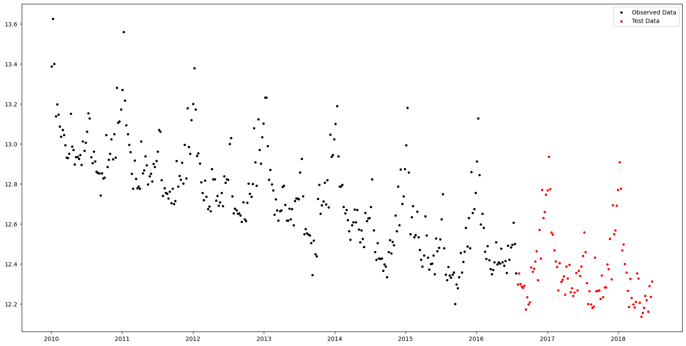
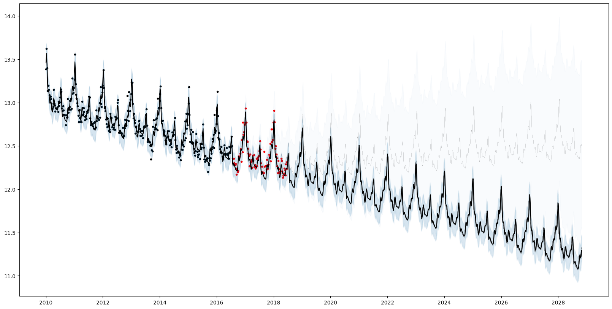
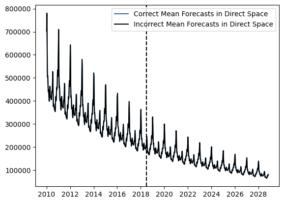
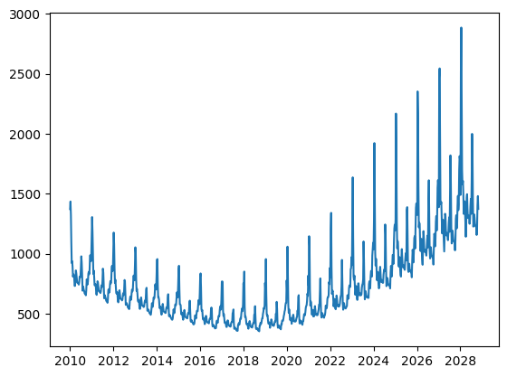

# Insurance Claims

This tutorial uses AutoGP to discover time series models of weekly insurance claims data.


```julia
import AutoGP
import CSV
import Dates
import DataFrames

using PyPlot: plt
```

We first load the [`iclaims.csv`](assets/iclaims.csv) dataset from disk.  Since the data is positive we apply a log transform and perform all modeling in this transformed space.


```julia
data = CSV.File("assets/iclaims.csv"; header=[:ds, :y], types=Dict(:ds=>Dates.Date, :y=>Float64));
df = DataFrames.DataFrame(data)
df[:,"y"] = log.(df[:,"y"])
show(df)
```

         │ ds          y
    ─────┼─────────────────────
       1 │ 2010-01-03  13.3866
       2 │ 2010-01-10  13.6242
       3 │ 2010-01-17  13.3987
       4 │ 2010-01-24  13.1375
       5 │ 2010-01-31  13.1968
       6 │ 2010-02-07  13.147
       7 │ 2010-02-14  13.0859
       8 │ 2010-02-21  13.035
       9 │ 2010-02-28  13.0704
      10 │ 2010-03-07  13.0448
      11 │ 2010-03-14  12.9924
      12 │ 2010-03-21  12.9314
      ⋮  │     ⋮          ⋮
     433 │ 2018-04-15  12.3287
     434 │ 2018-04-22  12.2068
     435 │ 2018-04-29  12.1359
     436 │ 2018-05-06  12.1562
     437 │ 2018-05-13  12.1819
     438 │ 2018-05-20  12.2407
     439 │ 2018-05-27  12.2202
     440 │ 2018-06-03  12.1628
     441 │ 2018-06-10  12.289
     442 │ 2018-06-17  12.2357
     443 │ 2018-06-24  12.3139
               420 rows omitted

Let's hold out the final 100 weeks of observations to serve as test data.


```julia
n_test = 100
n_train = DataFrames.nrow(df) - n_test
df_train = df[1:end-n_test, :]
df_test = df[end-n_test+1:end, :]

fig, ax = plt.subplots()
ax.scatter(df_train.ds, df_train.y, marker=".", color="k", label="Observed Data")
ax.scatter(df_test.ds, df_test.y, marker=".", color="r", label="Test Data")
ax.legend()

fig.set_size_inches((20, 10))
```


    

    


The next step is to initialize an [`AutoGP.GPModel`](@ref) instance and fit the model using sequential Monte Carlo structure learning.


```julia
model = AutoGP.GPModel(df_train.ds, df_train.y; n_particles=8);
```


```julia
AutoGP.seed!(10)
schedule = AutoGP.Schedule.linear_schedule(n_train, .20)
AutoGP.fit_smc!(model; schedule=schedule, n_mcmc=50, n_hmc=10, shuffle=true, adaptive_resampling=false, verbose=true);
```

    Running SMC round 69/343
    weights [3.38e-32, 4.11e-20, 7.26e-29, 1.02e-44, 4.74e-57, 9.10e-04, 9.99e-01, 2.71e-17]
    resampled true
    accepted MCMC[4/50] HMC[40/40]
    accepted MCMC[6/50] HMC[48/50]
    accepted MCMC[7/50] HMC[61/63]
    accepted MCMC[9/50] HMC[73/77]
    accepted MCMC[8/50] HMC[62/64]
    accepted MCMC[7/50] HMC[68/69]
    accepted MCMC[12/50] HMC[92/97]
    accepted MCMC[14/50] HMC[114/118]
    Running SMC round 138/343
    weights [1.10e-01, 1.39e-01, 1.98e-01, 1.71e-01, 1.66e-01, 1.78e-01, 1.80e-02, 2.08e-02]
    resampled true
    accepted MCMC[2/50] HMC[3/5]
    accepted MCMC[3/50] HMC[15/17]
    accepted MCMC[13/50] HMC[0/13]
    accepted MCMC[15/50] HMC[0/15]
    accepted MCMC[8/50] HMC[17/24]
    accepted MCMC[8/50] HMC[12/20]
    accepted MCMC[12/50] HMC[20/32]
    accepted MCMC[16/50] HMC[62/73]
    Running SMC round 207/343
    weights [1.21e-18, 1.72e-18, 1.00e+00, 3.00e-20, 1.48e-12, 2.59e-17, 8.86e-18, 1.49e-17]
    resampled true
    accepted MCMC[8/50] HMC[0/8]
    accepted MCMC[10/50] HMC[0/10]
    accepted MCMC[10/50] HMC[0/10]
    accepted MCMC[12/50] HMC[0/12]
    accepted MCMC[11/50] HMC[0/11]
    accepted MCMC[12/50] HMC[0/12]
    accepted MCMC[13/50] HMC[0/13]
    accepted MCMC[16/50] HMC[2/18]
    Running SMC round 276/343
    weights [1.52e-01, 1.63e-04, 1.51e-01, 4.79e-01, 1.04e-01, 9.47e-02, 1.76e-02, 1.36e-03]
    resampled true
    accepted MCMC[7/50] HMC[0/7]
    accepted MCMC[12/50] HMC[0/12]
    accepted MCMC[11/50] HMC[0/11]
    accepted MCMC[12/50] HMC[0/12]
    accepted MCMC[11/50] HMC[1/12]
    accepted MCMC[13/50] HMC[1/14]
    accepted MCMC[19/50] HMC[0/19]
    accepted MCMC[20/50] HMC[0/20]
    Running SMC round 343/343
    weights [4.25e-03, 3.87e-04, 5.39e-03, 5.37e-03, 2.16e-04, 5.35e-01, 4.40e-01, 9.31e-03]
    accepted MCMC[10/50] HMC[0/10]
    accepted MCMC[10/50] HMC[0/10]
    accepted MCMC[12/50] HMC[0/12]
    accepted MCMC[13/50] HMC[1/14]
    accepted MCMC[14/50] HMC[0/14]
    accepted MCMC[16/50] HMC[0/16]
    accepted MCMC[17/50] HMC[0/17]
    accepted MCMC[14/50] HMC[1/15]


Plotting the forecasts from each particle reflects the structural uncertainty.  7/8 particles have inferred a periodic component ([`AutoGP.GP.Periodic`](@ref)) with additive linear trend [`AutoGP.GP.Linear`](@ref). 1/8 of the particles has inferred a sum of a periodic kernel and gamma exponential ([`AutoGP.GP.GammaExponential`](@ref)) kernel, which is stationary but not "smooth" (formally, not mean-square differentiable).


```julia
# Generate in-sample and future predictions.
ds_future = range(start=df_test.ds[end]+Dates.Week(1), step=Dates.Week(1), length=54*10)
ds_query = vcat(df_train.ds, df_test.ds, ds_future)
forecasts = AutoGP.predict(model, ds_query; quantiles=[0.025, 0.975]);
weights = AutoGP.particle_weights(model)

# Plot the data.
fig, ax = plt.subplots()
ax.scatter(df_train.ds, df_train.y, marker=".", color="k", label="Observed Data")
ax.scatter(df_test.ds, df_test.y, marker=".", color="r", label="Test Data")

# Plot the forecasts from each particle.
for i=1:AutoGP.num_particles(model)
    subdf = forecasts[forecasts.particle.==i,:]
    ax.plot(subdf[!,"ds"], subdf[!,"y_mean"], color="k", linewidth=.1)
    ax.fill_between(
        subdf.ds, subdf[!,"y_0.025"], subdf[!,"y_0.975"];
        color="tab:blue", alpha=0.025)
end

# Plot the grand mean.
mvn = AutoGP.predict_mvn(model, ds_query)
ax.plot(ds_query, AutoGP.Distributions.mean(mvn), color="k");

fig.set_size_inches((20, 10))
```


    

    


```julia
for (w, k) in zip(AutoGP.particle_weights(model), AutoGP.covariance_kernels(model))
    println("Particle weight $(w)")
    display(k)
end
```

    Particle weight 0.004250523793423254


    ＋
    ├── LIN(0.43; 0.06, 0.40)
    └── PER(0.27, 0.15; 0.12)


    Particle weight 0.0003867955857232888


    ＋
    ├── LIN(0.21; 0.48, 0.28)
    └── PER(0.31, 0.15; 0.14)


    Particle weight 0.0053919770385446346


    ＋
    ├── PER(0.27, 0.15; 0.12)
    └── LIN(0.10; 0.11, 1.58)


    Particle weight 0.005373167226504197


    ＋
    ├── LIN(0.55; 0.04, 0.06)
    └── PER(0.27, 0.15; 0.12)


    Particle weight 0.0002161576411907359


    ＋
    ├── LIN(0.45; 0.05, 0.18)
    └── PER(0.27, 0.15; 0.12)


    Particle weight 0.5354267607568092


    ＋
    ├── PER(0.27, 0.15; 0.12)
    └── LIN(0.22; 0.19, 0.18)


    Particle weight 0.43964210411237775


    ＋
    ├── LIN(0.09; 0.12, 0.11)
    └── PER(0.23, 0.15; 0.11)


    Particle weight 0.009312513845423434


    ＋
    ├── GE(1.72, 1.66; 0.13)
    └── PER(0.29, 0.15; 0.12)


!!! note

    Mean forecasts, quantile forecasts, and probability densities values obtained via [`AutoGP.predict`](@ref) and [`AutoGP.predict_proba`](@ref) are all in the transformed (log space).  Only quantile forecasts can be transformed back to direct space via `exp`.  Converting mean forecasts and probability densities can be performed by using the [`Distributions.MvLogNormal`](https://juliastats.org/Distributions.jl/stable/multivariate/#Distributions.MvLogNormal) constructor, as demonstrated below.


```julia
import Distributions
log_mvn_components = [Distributions.MvLogNormal(d) for d in Distributions.components(mvn)]
log_mvn_weights = Distributions.probs(mvn)
log_mvn = Distributions.MixtureModel(log_mvn_components, log_mvn_weights);
```


```julia
fig, ax = plt.subplots()
ax.plot(ds_query, Distributions.mean(log_mvn), color="tab:blue", label="Correct Mean Forecasts in Direct Space")
ax.plot(ds_query, exp.(Distributions.mean(mvn)), color="k", label="Incorrect Mean Forecasts in Direct Space")
ax.axvline(df_test.ds[end], color="k", linestyle="--")
ax.legend()
```


    

    


    PyObject <matplotlib.legend.Legend object at 0x7f3598672c80>


The difference between the blue and black curves is too small to observe on the scale above; let us plot the bias that arises from doing a naive transformation.


```julia
fig, ax = plt.subplots()
ax.plot(ds_query, Distributions.mean(log_mvn) - exp.(Distributions.mean(mvn)));
```


    

    

